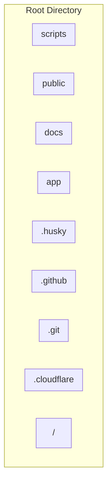

### Directory Structure

WIP moving details over from https://github.com/ff14-advanced-market-search/saddlebag-with-pockets/issues/499



### Directories and Descriptions

- **.git/**: Contains the Git version control system's metadata and history. Managed by Git, it tracks changes to files over time.

- **.cloudflare/**: Holds configuration files specific to Cloudflare deployments, possibly including settings for Cloudflare Workers or Pages.

- **.github/**: Includes GitHub-specific configurations like issue templates, pull request templates, and workflow definitions for GitHub Actions.

- **.husky/**: Contains Git hooks managed by Husky, enabling scripts to run at various points in the Git workflow (e.g., pre-commit, pre-push).

- **app/**: The main application source code directory. This is where the core logic and components of the application are developed.

  - [app/routes](https://github.com/ff14-advanced-market-search/saddlebag-with-pockets/wiki/Repo-Architecture-%E2%80%90--app-routes): each file is a different page. To make a new page just make a new file in this dir.

- **docs/**: Contains documentation files and resources for the project, such as guides, tutorials, and developer documentation.

- **public/**: Stores static assets served directly to clients, including images, fonts, and static HTML files.

- **scripts/**: Contains custom scripts used for various project tasks like building, deploying, or utility functions.

<details>
<summary>Analysis chain</summary>

@cohenaj194, to provide detailed descriptions of all the directories in the root directory and include diagrams, I'll first gather the list of directories.

</details>

<details>
<summary>Scripts executed</summary>

The following scripts were executed for the analysis:

Script:

```shell
#!/bin/bash
# List directories in the root of the repository
find . -maxdepth 1 -type d ! -path '.' -printf '%f\n'

```

Length of output: 111

</details>
